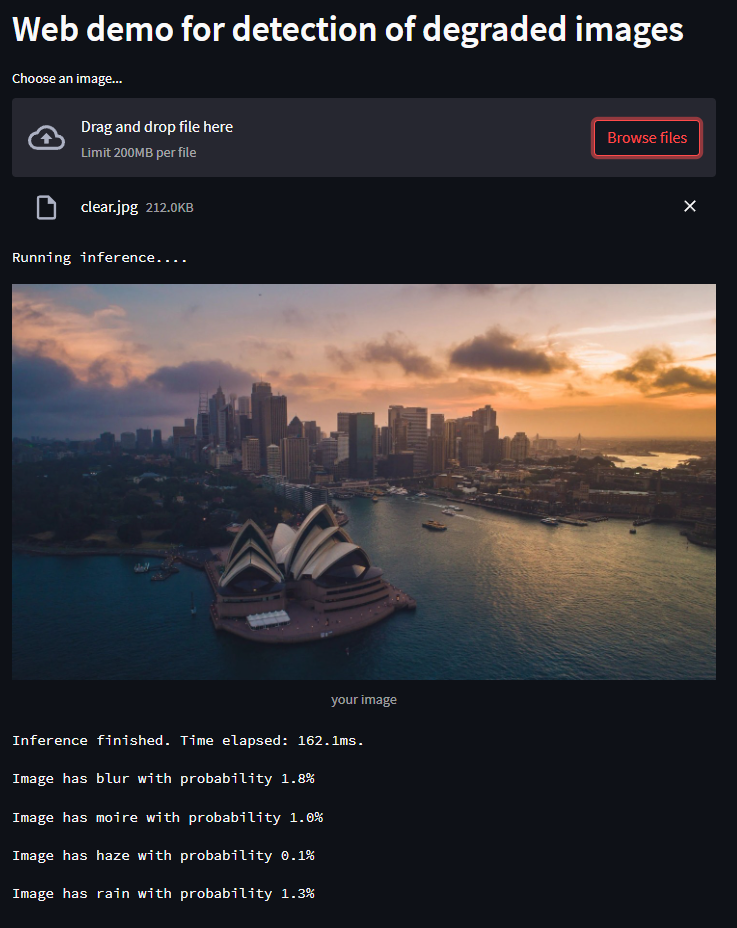
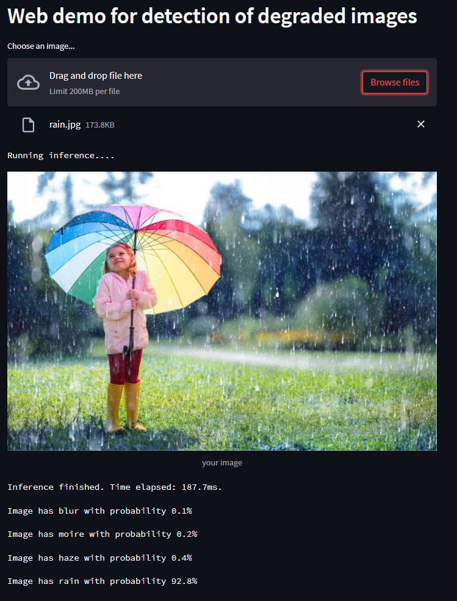
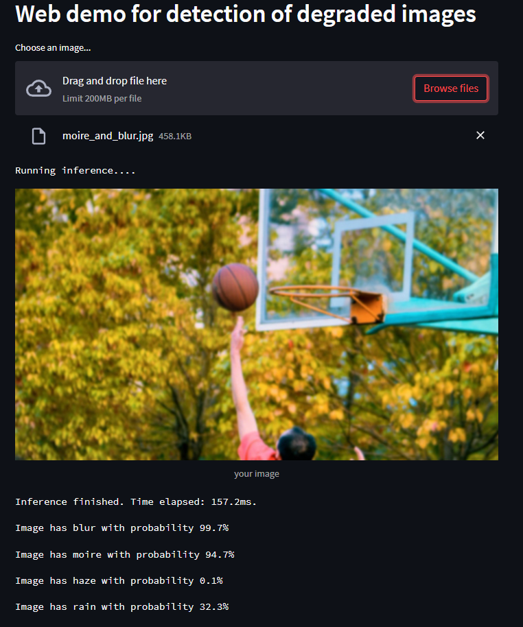

# Term Paper
Final project for HSE program

In this repository you can find jupyter notebooks that were used while developping the solution, as well as the web application for showing the model inference.
This project aimed to develop a multi-label classification model for 4 types of degradations: blur, moire, haze and rain.

# Architecture

We based the architecture of our model on [MobileViT: Light-weight, General-purpose, and Mobile-friendly Vision Transformer](https://arxiv.org/abs/2110.02178)
You can find the model, converted to onnx( this one is used for inferencing in this application) in saved_models/exported folder.

# Metrics

We collected metrics on each class separately and a total F1-score. You can see obtained metrics here.
| class/metric     | precision      | recall     | F1-score |
|------------------|----------------|------------|----------|
| Blur             | 0.94           | 0.977      | 0.956    |
| Moire            | 0.929          | 0.981      | 0.955    |
| Haze             | 0.997          | 0.999      | 0.998    |
| Rain             | 0.817          | 0.97       | 0.89     |
| Total            | None           | None       | 0.95     |

# Requirements
install the requirements by running 
```code
pip install -r requirements.txt
```

# Export
You can see how the export is done in the script src/convert_to_onnx.py. Upon running it, it will show the results for both torch version and exported onnx version.
The exported model already exists in saved_models/exported folder, the same model is used for inference, so by converting it again you will just replace it.
```code
python convert_to_onnx.py
```

# Web Demo
In Order to run the web demonstration, type the following
```code
streamlit run web_demo.py
```
# Runtime
## Our model is trained in a way that it tries to detect each detection separately. Here, we pass it an image without any visiable degaradations.

## We can detect a single degradation.

## And multiple, which is a rare case.

